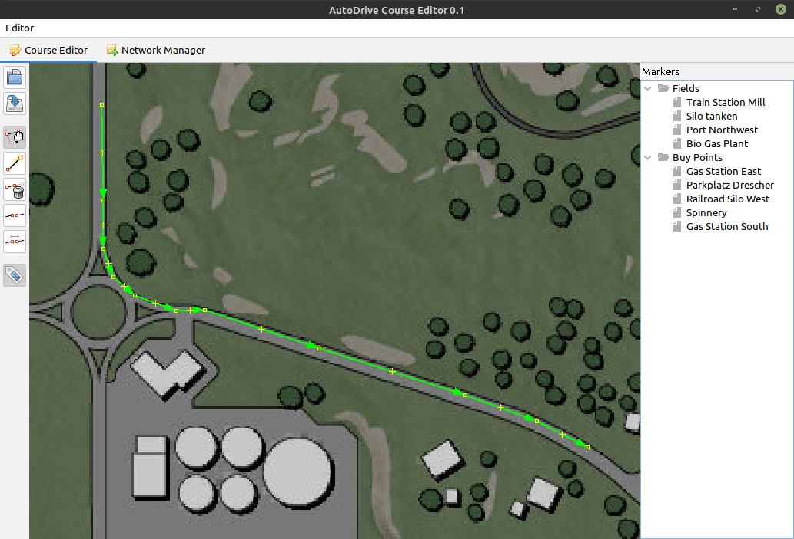

# AutoDrive RouteManager
This is an external graphical editor and route manager for the [AutoDrive Mod](https://github.com/Stephan-S/FS19_AutoDrive) for [Farming Simulator 19](https://www.farming-simulator.com/) , which allows you to create and
edit AutoDrive routes. Afterwards these routes can be stored again in the mod directory, in the AutoDrive Route Manager or on an external server.
It is also possible to exchange routes with other users via the external server and download them for your own game.

# Java
The AutoDrive RouteManager requires a Java installation of at least version 11. JRE or JDK are both possible.
Current Java versions can be downloaded here: <https://www.oracle.com/java/technologies/javase-downloads.html>
Installation instructions can be found here: <https://www3.ntu.edu.sg/home/ehchua/programming/howto/JDK_Howto.html>

To say it right away: [Java is still free](https://docs.google.com/document/d/1nFGazvrCvHMZJgFstlbzoHjpAVwv5DEdnaBr_5pKuHo/preview), especially for personal use. And I guess that will be the case  
for the majority of users here.

If you still have concerns, you can of course also use the [OpenJdk](https://jdk.java.net/archive/).

# Start AutoDrive RouteManager
The editor can be started with the supplied CMD file: "Open Editor with Console to see errors.cmd". The editor can also be started from the command line: java -jar AD.jar

The editor will create the log file autoDriveEditor.log, which is used for later troubleshooting. This file has a maximum size of 20MB. A maximum of 3 version files are then created.
To save the configuration, the editor will also create the adEditor.conf file.

At the first start the LS19 game directory is queried. In most cases, the directory is: c:\Documents\My Games\FarmingSimulator2019. This entry is only necessary at the first start:

# Network Manager
With the network manager, routes that were previously created with the route manager can be uploaded to a central server. Routes can then be downloaded from this server and loaded into the game via the RouteManager.
Switch to the Network Manager tab.

On the left side are the local routes that were created with the route manager. On the right side are the routes on the server.
If a route should be uploaded, it can be marked on the left. With a right mouse click a menu appears with Upload.
The same on the right side. To download, mark a route and then right click download.

