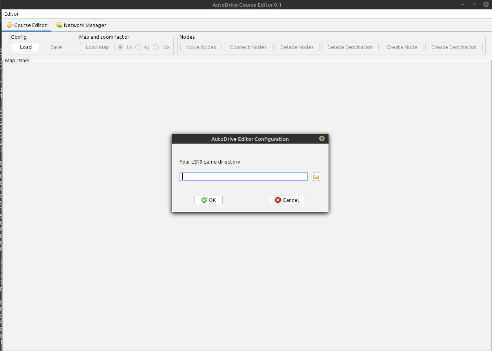
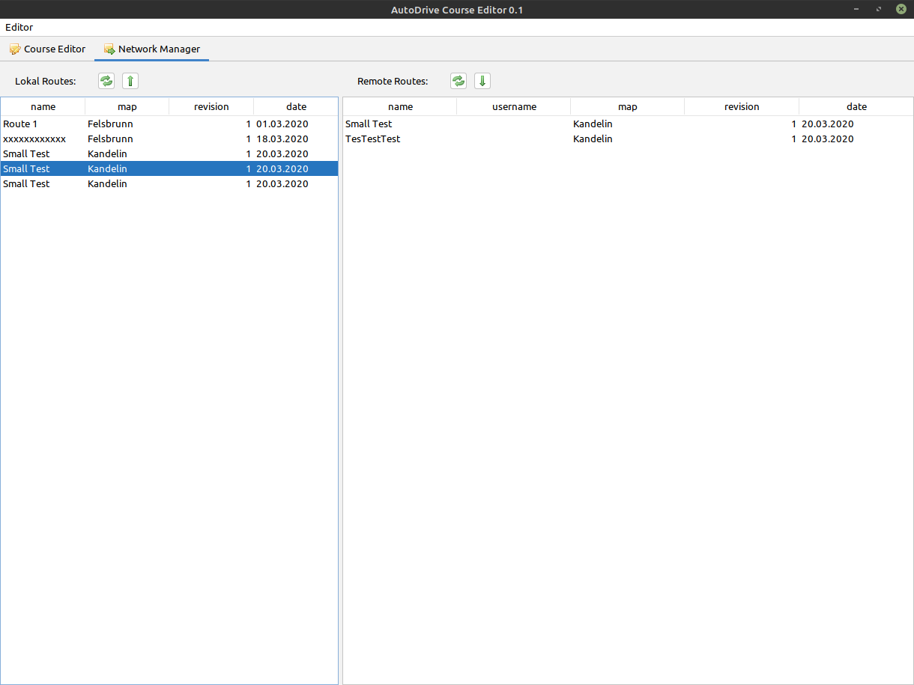
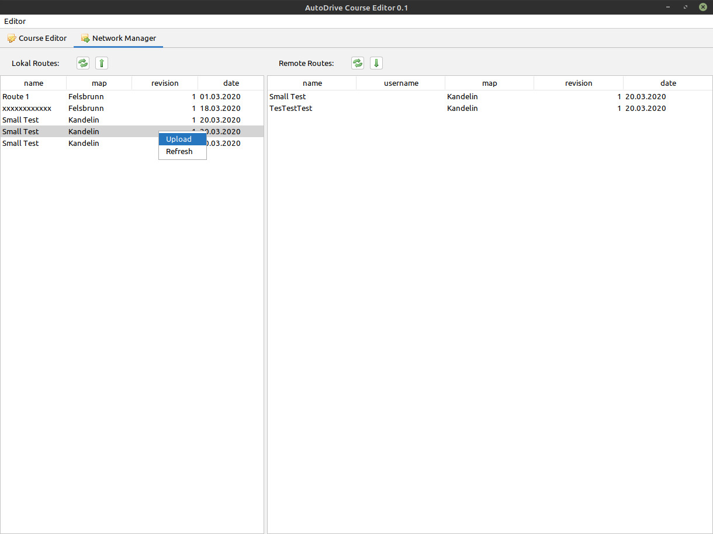

# Java
Java version greater than 11 is required. JRE or JDK are both possible.
Current Java versions can be downloaded here: <https://www.oracle.com/java/technologies/javase-downloads.html>
Installation instructions can be found here: <https://www3.ntu.edu.sg/home/ehchua/programming/howto/JDK_Howto.html>

# Start AutoDrive Course Editor
The editor can be started with the supplied CMD file: "Open Editor with Console to see errors.cmd". The editor can also be started from the command line: java -jar AD.jar

The editor will create the log file autoDriveEditor.log, which is used for later troubleshooting. This file has a maximum size of 20MB. A maximum of 3 version files are then created.
To save the configuration, the editor will also create the adEditor.conf file.

At the first start the LS19 game directory is queried. In most cases, the directory is: c:\Documents\My Games\FarmingSimulator2019. This entry is only necessary at the first start:

# Editor
coming soon...

# Network Manager
With the network manager, routes that were previously created with the route manager can be uploaded to a central server. Routes can then be downloaded from this server and loaded into the game via the RouteManager.
Switch to the Network Manager tab.

On the left side are the local routes that were created with the route manager. On the right side are the routes on the server.
If a route should be uploaded, it can be marked on the left. With a right mouse click a menu appears with Upload.
The same on the right side. To download, mark a route and then right click download.

